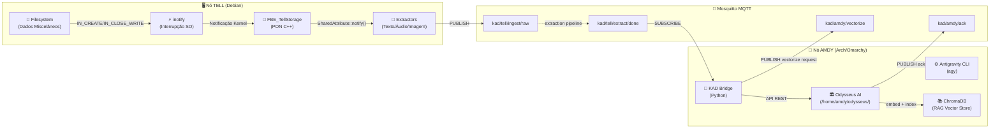
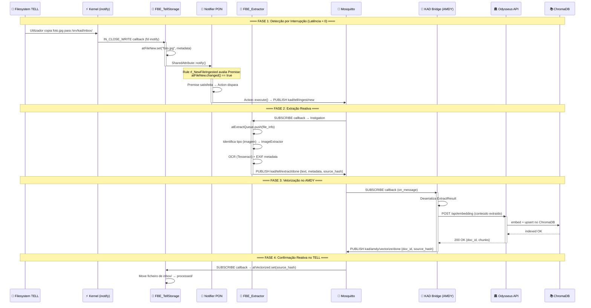
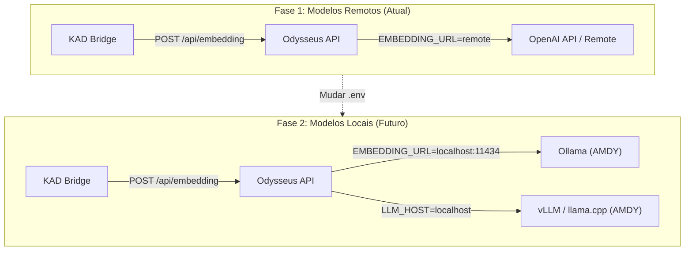

# Blueprint Arquitetural — Projeto KAD 1.0

**Autor:** Arquiteto Mestre DATA  
**Paradigma:** PON C++ 4.0 IoT — Reatividade Absoluta  
**Data:** 2026-06-27  
**Versão:** v1.0-APPROVED

---

## Visão Geral

O Projeto KAD 1.0 (Knowledge Acquisition & Distribution) é o sistema nervoso que conecta dois nós computacionais — **TELL** (extração sensorial) e **AMDY** (cognição/ação) — através de uma topologia Publish/Subscribe completamente reativa, governada pelo Paradigma Orientado a Notificações (PON). A computação em *idle* é **zero**. Nenhum ciclo de CPU é consumido a verificar se algo aconteceu. Quando algo acontece, o sistema operativo e o broker notificam — e só então a computação ocorre.



---

## 1. Estrutura do Repositório

> [!IMPORTANT]
> O código do Odysseus **NÃO** reside neste repositório. O KAD 1.0 interage com o Odysseus via API REST e MCP — nunca por importação direta de módulos. O diretório `/home/amdy/odysseus/` é tratado como uma dependência externa.

```
kad-1.0/
├── README.md                          # Visão geral, setup, arquitetura
├── LICENSE
├── .gitignore
├── .env.example                       # Template de variáveis (MQTT, Odysseus URL, API keys)
│
├── docs/
│   ├── architecture.md                # Este blueprint (versão final)
│   ├── pon-primer.md                  # Guia do PON para contribuidores
│   ├── mqtt-topology.md              # Mapa completo de tópicos
│   └── diagrams/                      # Diagramas Mermaid/SVG exportados
│       ├── data-flow.svg
│       └── pon-fbe-lifecycle.svg
│
├── broker/
│   ├── mosquitto.conf                 # Configuração Mosquitto (listener, ACLs, persistence)
│   ├── acl.conf                       # ACLs MQTT por cliente (tell-node, amdy-node)
│   ├── docker-compose.yml             # Mosquitto containerizado (opcional)
│   └── scripts/
│       └── health-check.sh            # Verificação pontual do broker (não cron!)
│
├── tell/                              # ═══ Código que corre EXCLUSIVAMENTE no TELL ═══
│   ├── CMakeLists.txt                 # Build system (CMake)
│   ├── conanfile.txt                  # Dependências C++ (Paho MQTT, nlohmann/json)
│   │
│   ├── src/
│   │   ├── main.cpp                   # Entry point — regista FBEs, inicia Notifier
│   │   │
│   │   ├── pon/                       # ═══ Camada PON (Lógico-Causal) ═══
│   │   │   ├── notifier.hpp           # Motor de notificações central (avalia Rules)
│   │   │   ├── notifier.cpp
│   │   │   ├── rule.hpp               # Rule = {Premises → Condition → Actions}
│   │   │   ├── rule.cpp
│   │   │   ├── premise.hpp            # Premise = referência a SharedAttribute + operador
│   │   │   ├── premise.cpp
│   │   │   ├── action.hpp             # Action = Instigation ou Method call
│   │   │   ├── action.cpp
│   │   │   ├── instigation.hpp        # Instigation = publicação MQTT ou mutação de FBE
│   │   │   └── instigation.cpp
│   │   │
│   │   ├── fbe/                       # ═══ Camada Facto-Execucional (FBEs) ═══
│   │   │   ├── shared_attribute.hpp   # SharedAttribute<T> — notifica o Notifier ao mutar
│   │   │   ├── shared_attribute.cpp
│   │   │   ├── fbe_base.hpp           # Classe base de todos os FBEs
│   │   │   ├── fbe_base.cpp
│   │   │   ├── fbe_tell_storage.hpp   # FBE: monitoriza filesystem via inotify
│   │   │   ├── fbe_tell_storage.cpp
│   │   │   ├── fbe_extractor.hpp      # FBE: gere extração de conteúdo
│   │   │   └── fbe_extractor.cpp
│   │   │
│   │   ├── io/                        # ═══ Adaptadores I/O ═══
│   │   │   ├── inotify_watcher.hpp    # Wrapper inotify (IN_CREATE, IN_CLOSE_WRITE)
│   │   │   ├── inotify_watcher.cpp
│   │   │   ├── mqtt_publisher.hpp     # Wrapper Paho MQTT C++ (publish assíncrono)
│   │   │   ├── mqtt_publisher.cpp
│   │   │   ├── mqtt_subscriber.hpp    # Wrapper Paho MQTT C++ (subscribe + callback)
│   │   │   └── mqtt_subscriber.cpp
│   │   │
│   │   └── extractors/                # ═══ Plugins de Extração ═══
│   │       ├── extractor_base.hpp     # Interface IExtractor
│   │       ├── text_extractor.cpp     # .txt, .md, .csv, .json, .xml
│   │       ├── pdf_extractor.cpp      # .pdf (poppler/pdftotext)
│   │       ├── image_extractor.cpp    # .jpg, .png, .webp → OCR (Tesseract) + metadata EXIF
│   │       ├── audio_extractor.cpp    # .mp3, .wav, .ogg → transcrição (Whisper CLI)
│   │       └── office_extractor.cpp   # .docx, .xlsx, .pptx (via LibreOffice headless)
│   │
│   ├── tests/
│   │   ├── test_shared_attribute.cpp
│   │   ├── test_fbe_tell_storage.cpp
│   │   ├── test_notifier.cpp
│   │   └── test_mqtt_integration.cpp
│   │
│   ├── config/
│   │   ├── tell.env                   # Variáveis do nó TELL
│   │   └── watch_paths.json           # Diretórios monitorizados por inotify
│   │
│   └── scripts/
│       ├── install-deps.sh            # Instala deps no Debian (mosquitto-clients, tesseract, etc.)
│       └── deploy.sh                  # Compila e instala o daemon como systemd unit
│
├── amdy/                              # ═══ Código que corre EXCLUSIVAMENTE no AMDY ═══
│   ├── requirements.txt               # Deps Python (paho-mqtt, httpx, etc.)
│   ├── pyproject.toml
│   │
│   ├── src/
│   │   ├── __init__.py
│   │   ├── bridge.py                  # ═══ KAD Bridge ═══ — Subscreve MQTT, chama Odysseus API
│   │   ├── mqtt_listener.py           # Cliente MQTT assíncrono (callback-driven, zero polling)
│   │   ├── odysseus_client.py         # HTTP client para Odysseus REST API (localhost:7000)
│   │   ├── vectorizer.py              # Orquestra embed + index via Odysseus RAG/Memory APIs
│   │   ├── config.py                  # Carrega .env, valida configuração
│   │   └── models.py                  # Dataclasses para payloads MQTT (tipagem forte)
│   │
│   ├── mcp/
│   │   ├── kad_mcp_server.py          # MCP Server: expõe ferramentas KAD ao Antigravity
│   │   └── mcp_config.json            # Configuração MCP para registar no Antigravity
│   │
│   ├── tests/
│   │   ├── test_bridge.py
│   │   ├── test_mqtt_listener.py
│   │   ├── test_odysseus_client.py
│   │   └── test_vectorizer.py
│   │
│   ├── config/
│   │   └── amdy.env                   # Variáveis do nó AMDY
│   │
│   └── scripts/
│       ├── install.sh                 # Setup venv + deps
│       └── run-bridge.sh              # Lança o KAD Bridge como systemd unit
│
├── shared/                            # ═══ Contratos partilhados entre TELL e AMDY ═══
│   ├── schemas/
│   │   ├── ingest_event.schema.json   # JSON Schema: evento de ingestão
│   │   ├── extract_result.schema.json # JSON Schema: resultado de extração
│   │   └── vectorize_cmd.schema.json  # JSON Schema: comando de vetorização
│   └── mqtt_topics.py                 # Definição canónica dos tópicos MQTT (Python)
│   └── mqtt_topics.hpp                # Definição canónica dos tópicos MQTT (C++)
│
└── .agents/                           # ═══ Configuração Antigravity (Workspace) ═══
    ├── AGENTS.md                      # Rules para o agy: contexto PON, convenções, limites
    └── skills/
        └── kad_pon/
            └── SKILL.md               # Skill: instruções PON para o agente AI
```

---

## 2. Topologia MQTT (PON IoT)

> [!NOTE]
> Todos os tópicos seguem a convenção `kad/{nó_origem}/{domínio}/{ação}`. O QoS é **1** (at-least-once) para garantir entrega sem duplicar estado. Retained messages são usadas apenas em tópicos de status.

### 2.1 Mapa Completo de Tópicos

| Tópico | Publisher | Subscriber(s) | QoS | Retain | Payload | Propósito |
|---|---|---|---|---|---|---|
| `kad/tell/ingest/new` | TELL (FBE_TellStorage) | TELL (FBE_Extractor) | 1 | No | `IngestEvent` | Novo ficheiro detectado por inotify |
| `kad/tell/extract/started` | TELL (FBE_Extractor) | AMDY (Bridge) | 1 | No | `ExtractStatus` | Extração iniciada (telemetria) |
| `kad/tell/extract/done` | TELL (FBE_Extractor) | AMDY (Bridge) | 1 | No | `ExtractResult` | Conteúdo extraído pronto para vetorização |
| `kad/tell/extract/error` | TELL (FBE_Extractor) | AMDY (Bridge) | 1 | No | `ExtractError` | Falha na extração |
| `kad/amdy/vectorize/request` | AMDY (Bridge) | AMDY (Vectorizer) | 1 | No | `VectorizeCmd` | Comando para vetorizar conteúdo extraído |
| `kad/amdy/vectorize/done` | AMDY (Vectorizer) | TELL (FBE_TellStorage) | 1 | No | `VectorizeAck` | Confirmação de vetorização concluída |
| `kad/tell/status` | TELL (main) | AMDY (Bridge) | 0 | **Yes** | `NodeStatus` | Heartbeat / status do nó (retained) |
| `kad/amdy/status` | AMDY (Bridge) | TELL (main) | 0 | **Yes** | `NodeStatus` | Heartbeat / status do nó (retained) |
| `kad/tell/storage/stats` | TELL (FBE_TellStorage) | AMDY (Bridge) | 0 | **Yes** | `StorageStats` | Estatísticas de armazenamento (retained) |

### 2.2 Fluxo Completo: Nova Imagem no TELL → Conhecimento Vetorizado no AMDY



### 2.3 Payloads (JSON Schemas)

#### IngestEvent (`kad/tell/ingest/new`)
```json
{
  "event_id": "uuid-v4",
  "timestamp": "2026-06-27T23:10:09Z",
  "source_node": "tell",
  "file": {
    "path": "/srv/kad/inbox/foto.jpg",
    "name": "foto.jpg",
    "size_bytes": 2048576,
    "mime_type": "image/jpeg",
    "sha256": "a1b2c3d4..."
  },
  "inotify_event": "IN_CLOSE_WRITE"
}
```

#### ExtractResult (`kad/tell/extract/done`)
```json
{
  "event_id": "uuid-v4",
  "source_event_id": "uuid-v4-original",
  "timestamp": "2026-06-27T23:10:12Z",
  "source_node": "tell",
  "source_file": {
    "path": "/srv/kad/inbox/foto.jpg",
    "sha256": "a1b2c3d4..."
  },
  "extraction": {
    "extractor": "image_extractor",
    "content_type": "text/plain",
    "text": "Texto extraído via OCR...",
    "metadata": {
      "exif_date": "2026-06-20T14:30:00Z",
      "dimensions": "3024x4032",
      "camera": "iPhone 15 Pro"
    },
    "confidence": 0.92,
    "duration_ms": 1340
  }
}
```

#### VectorizeCmd (`kad/amdy/vectorize/request`)
```json
{
  "event_id": "uuid-v4",
  "source_event_id": "uuid-v4-extraction",
  "timestamp": "2026-06-27T23:10:13Z",
  "content": "Texto extraído via OCR...",
  "metadata": {
    "source_node": "tell",
    "source_file": "foto.jpg",
    "source_sha256": "a1b2c3d4...",
    "extractor": "image_extractor",
    "original_mime": "image/jpeg"
  },
  "target": {
    "collection": "kad_knowledge",
    "owner": "amdy"
  }
}
```

---

## 3. Boilerplate PON C++ (Nó TELL)

> [!NOTE]
> Este é pseudocódigo estrutural que demonstra a separação rigorosa entre a camada Facto-Execucional (FBE + Attributes + Methods) e a camada Lógico-Causal (Rules + Premises + Actions + Instigations). **Nenhum `while(true)`, `sleep()` ou polling** existe neste código. O `inotify` é registado como um file descriptor que o event loop do SO (epoll) monitoriza passivamente.

### 3.1 SharedAttribute (Mecanismo de Notificação)

```cpp
// tell/src/fbe/shared_attribute.hpp
#pragma once
#include <functional>
#include <vector>
#include <string>
#include <mutex>

// Forward declaration
class Notifier;

/**
 * SharedAttribute<T> — O átomo fundamental do PON.
 * 
 * Quando o valor muta via set(), notifica automaticamente o Notifier central,
 * que por sua vez avalia as Premises que referenciam este atributo.
 * Nunca é necessário verificar ativamente se o valor mudou.
 */
template<typename T>
class SharedAttribute {
private:
    std::string name_;
    T value_;
    T previous_value_;
    bool changed_ = false;
    Notifier* notifier_ = nullptr;  // Referência ao motor PON
    std::mutex mutex_;

public:
    SharedAttribute(const std::string& name, T initial, Notifier* notifier)
        : name_(name), value_(initial), previous_value_(initial), notifier_(notifier) {}

    /**
     * SET — O único ponto de mutação.
     * Compara com o valor anterior. Se diferente, marca changed_=true
     * e dispara notify() no Notifier → avaliação de Premises.
     * Custo computacional em idle: ZERO.
     */
    void set(const T& new_value) {
        std::lock_guard<std::mutex> lock(mutex_);
        if (value_ == new_value) return;  // Sem mudança → sem notificação
        previous_value_ = value_;
        value_ = new_value;
        changed_ = true;
        if (notifier_) {
            notifier_->onAttributeChanged(this->name_);
        }
    }

    const T& get() const { return value_; }
    const T& previous() const { return previous_value_; }
    bool changed() const { return changed_; }
    const std::string& name() const { return name_; }
    
    void resetChanged() { 
        std::lock_guard<std::mutex> lock(mutex_);
        changed_ = false; 
    }
};
```

### 3.2 FBE_TellStorage (Fact Base Element)

```cpp
// tell/src/fbe/fbe_tell_storage.hpp
#pragma once
#include "fbe_base.hpp"
#include "shared_attribute.hpp"
#include "../io/inotify_watcher.hpp"
#include <string>
#include <nlohmann/json.hpp>

using json = nlohmann::json;

/**
 * FBE_TellStorage — Fact Base Element que representa o armazenamento do TELL.
 * 
 * CAMADA FACTO-EXECUCIONAL:
 * - Attributes: representam factos (estado) do filesystem
 * - Methods: operam sobre os factos (mover ficheiro, calcular hash)
 * 
 * NÃO contém lógica condicional. A decisão "o que fazer quando um ficheiro
 * chega" pertence às Rules na camada lógico-causal.
 */
class FBE_TellStorage : public FBE_Base {
public:
    // ═══ SHARED ATTRIBUTES (Factos observáveis) ═══
    
    /** 
     * atFileNew — Muda quando inotify detecta IN_CLOSE_WRITE.
     * O callback do inotify NÃO é um poll — é uma interrupção do kernel
     * Linux entregue via file descriptor, monitorizado por epoll().
     */
    SharedAttribute<json> atFileNew;
    
    /**
     * atFileCount — Número total de ficheiros no inbox.
     * Muda reativamente quando atFileNew é notificado.
     */
    SharedAttribute<int> atFileCount;
    
    /**
     * atVectorized — Hash do último ficheiro confirmado como vetorizado.
     * Mutado quando recebemos ACK do AMDY via MQTT callback.
     */
    SharedAttribute<std::string> atVectorized;
    
    /**
     * atStorageHealth — Estado do disco (bytes livres, percentagem).
     * Mutado por callback do kernel (statvfs em resposta a write events).
     */
    SharedAttribute<json> atStorageHealth;

private:
    InotifyWatcher watcher_;
    std::string inbox_path_;
    std::string processed_path_;

public:
    FBE_TellStorage(Notifier* notifier, const std::string& inbox, const std::string& processed)
        : FBE_Base("TellStorage", notifier)
        , atFileNew("TellStorage.fileNew", json{}, notifier)
        , atFileCount("TellStorage.fileCount", 0, notifier)
        , atVectorized("TellStorage.vectorized", "", notifier)
        , atStorageHealth("TellStorage.storageHealth", json{}, notifier)
        , inbox_path_(inbox)
        , processed_path_(processed)
    {
        // ═══ REGISTO INOTIFY (interrupção, NÃO polling) ═══
        // O watcher regista-se no epoll do event loop.
        // O kernel Linux notifica via fd quando há atividade no diretório.
        // CPU em idle: ZERO.
        watcher_.watch(inbox_path_, IN_CLOSE_WRITE | IN_MOVED_TO,
            [this](const inotify_event& event) {
                this->onFileEvent(event);
            }
        );
    }

    // ═══ METHODS (Operações sobre factos) ═══

    /**
     * Callback do inotify — chamado APENAS quando o kernel notifica.
     * Muta o SharedAttribute, que dispara a cadeia PON.
     */
    void onFileEvent(const inotify_event& event) {
        std::string filename(event.name);
        std::string full_path = inbox_path_ + "/" + filename;
        
        json file_info = {
            {"path", full_path},
            {"name", filename},
            {"size_bytes", getFileSize(full_path)},
            {"mime_type", detectMimeType(full_path)},
            {"sha256", computeSHA256(full_path)},
            {"timestamp", currentISO8601()}
        };
        
        // *** A MUTAÇÃO QUE DISPARA TUDO ***
        // set() → Notifier::onAttributeChanged() → Premise evaluation → Action
        atFileNew.set(file_info);
        atFileCount.set(atFileCount.get() + 1);
    }
    
    /**
     * Move ficheiro processado — chamado por Action quando atVectorized muda.
     */
    void moveToProcessed(const std::string& filename) {
        std::filesystem::rename(
            inbox_path_ + "/" + filename,
            processed_path_ + "/" + filename
        );
    }

    // Métodos utilitários (privados)
    size_t getFileSize(const std::string& path);
    std::string detectMimeType(const std::string& path);
    std::string computeSHA256(const std::string& path);
    std::string currentISO8601();
};
```

### 3.3 Rules & Premises (Camada Lógico-Causal)

```cpp
// tell/src/main.cpp (fragmento de registo de Rules)

#include "pon/notifier.hpp"
#include "pon/rule.hpp"
#include "pon/premise.hpp"
#include "pon/action.hpp"
#include "pon/instigation.hpp"
#include "fbe/fbe_tell_storage.hpp"
#include "fbe/fbe_extractor.hpp"
#include "io/mqtt_publisher.hpp"

int main() {
    // ═══ INICIALIZAÇÃO ═══
    Notifier notifier;
    MqttPublisher mqtt("tcp://mosquitto-broker:1883", "tell-node");
    
    // FBEs (camada facto-execucional)
    FBE_TellStorage storage(&notifier, "/srv/kad/inbox", "/srv/kad/processed");
    FBE_Extractor   extractor(&notifier);

    // ═══ REGRAS (camada lógico-causal) ═══
    
    /**
     * RULE 1: rl_NewFileDetected
     * QUANDO: atFileNew muda (inotify detectou ficheiro)
     * ENTÃO: Publica evento MQTT + enfileira para extração
     * 
     * Separação PON: a Rule NÃO sabe como a detecção aconteceu (inotify).
     * Apenas reage ao facto "atFileNew mudou".
     */
    Rule rl_NewFileDetected("rl_NewFileDetected", {
        // Premises — condições sobre SharedAttributes
        Premise(&storage.atFileNew, PremiseOp::CHANGED),
    }, {
        // Actions — o que fazer quando TODAS as premises são satisfeitas
        
        // Action 1: Publica no MQTT (notifica o ecossistema)
        Action([&mqtt, &storage]() {
            mqtt.publish("kad/tell/ingest/new", 
                storage.atFileNew.get().dump(), QoS::AT_LEAST_ONCE);
        }),
        
        // Action 2: Instigation — muta FBE_Extractor para iniciar extração
        Instigation([&extractor, &storage]() {
            extractor.atExtractQueue.set(storage.atFileNew.get());
        }),
        
        // Action 3: Reset do atributo para detetar próximo evento
        Action([&storage]() {
            storage.atFileNew.resetChanged();
        }),
    });
    
    /**
     * RULE 2: rl_ExtractionComplete
     * QUANDO: atExtractResult muda (extração terminou)
     * ENTÃO: Publica resultado no MQTT para o AMDY vetorizar
     */
    Rule rl_ExtractionComplete("rl_ExtractionComplete", {
        Premise(&extractor.atExtractResult, PremiseOp::CHANGED),
        Premise(&extractor.atExtractResult, PremiseOp::NOT_EMPTY),
    }, {
        Action([&mqtt, &extractor]() {
            mqtt.publish("kad/tell/extract/done",
                extractor.atExtractResult.get().dump(), QoS::AT_LEAST_ONCE);
        }),
        Action([&extractor]() {
            extractor.atExtractResult.resetChanged();
        }),
    });
    
    /**
     * RULE 3: rl_VectorizationConfirmed
     * QUANDO: atVectorized muda (AMDY confirmou vetorização via MQTT)
     * ENTÃO: Move ficheiro para processed/
     */
    Rule rl_VectorizationConfirmed("rl_VectorizationConfirmed", {
        Premise(&storage.atVectorized, PremiseOp::CHANGED),
    }, {
        Action([&storage]() {
            // Extrai filename do hash e move
            storage.moveToProcessed(
                storage.atVectorized.get()  // source_hash → lookup filename
            );
            storage.atVectorized.resetChanged();
        }),
    });

    // ═══ REGISTO DAS RULES NO NOTIFIER ═══
    notifier.registerRule(rl_NewFileDetected);
    notifier.registerRule(rl_ExtractionComplete);
    notifier.registerRule(rl_VectorizationConfirmed);

    // ═══ SUBSCRIÇÃO MQTT (callback-driven, NÃO polling) ═══
    // O callback do MQTT subscriber muta SharedAttributes → cadeia PON
    mqtt.subscribe("kad/amdy/vectorize/done", [&storage](const std::string& payload) {
        auto ack = json::parse(payload);
        storage.atVectorized.set(ack["source_hash"].get<std::string>());
    });

    // ═══ EVENT LOOP ═══
    // epoll_wait() — bloqueante, CPU em idle: ZERO.
    // Acorda APENAS quando:
    //   1. inotify fd tem eventos (ficheiro novo)
    //   2. MQTT socket tem dados (mensagem recebida)
    //   3. Signal fd recebe SIGTERM/SIGINT (shutdown)
    notifier.run();  // Internamente: epoll_wait() sobre todos os fds registados
    
    return 0;
}
```

### 3.4 InotifyWatcher (Adaptador SO)

```cpp
// tell/src/io/inotify_watcher.hpp
#pragma once
#include <sys/inotify.h>
#include <functional>
#include <string>
#include <unordered_map>

/**
 * InotifyWatcher — Zero-overhead filesystem monitoring.
 * 
 * Usa inotify do Linux (interrupção do kernel, NÃO polling).
 * O file descriptor do inotify é registado no epoll do Notifier.
 * Quando o kernel detecta atividade no diretório monitorizado,
 * o epoll_wait() acorda e chama o callback associado.
 * 
 * CPU em idle: ZERO (bloqueado em epoll_wait).
 */
class InotifyWatcher {
private:
    int inotify_fd_;
    std::unordered_map<int, std::function<void(const inotify_event&)>> callbacks_;

public:
    InotifyWatcher() {
        inotify_fd_ = inotify_init1(IN_NONBLOCK | IN_CLOEXEC);
        if (inotify_fd_ < 0) {
            throw std::runtime_error("Failed to initialize inotify");
        }
    }

    ~InotifyWatcher() {
        if (inotify_fd_ >= 0) close(inotify_fd_);
    }

    /**
     * Regista um diretório para monitorização.
     * O fd é posteriormente adicionado ao epoll do Notifier.
     */
    int watch(const std::string& path, uint32_t mask,
              std::function<void(const inotify_event&)> callback) {
        int wd = inotify_add_watch(inotify_fd_, path.c_str(), mask);
        if (wd < 0) {
            throw std::runtime_error("Failed to add inotify watch: " + path);
        }
        callbacks_[wd] = std::move(callback);
        return wd;
    }

    /** Retorna o fd para registo no epoll do Notifier. */
    int fd() const { return inotify_fd_; }

    /** Processa eventos pendentes — chamado pelo epoll handler. */
    void processEvents() {
        char buffer[4096] __attribute__((aligned(__alignof__(inotify_event))));
        ssize_t len = read(inotify_fd_, buffer, sizeof(buffer));
        if (len <= 0) return;

        for (char* ptr = buffer; ptr < buffer + len; ) {
            auto* event = reinterpret_cast<inotify_event*>(ptr);
            if (event->len > 0 && callbacks_.count(event->wd)) {
                callbacks_[event->wd](*event);
            }
            ptr += sizeof(inotify_event) + event->len;
        }
    }
};
```

---

## 4. Integração MCP (Antigravity ↔ Odysseus ↔ KAD)

> [!IMPORTANT]
> O Odysseus já expõe MCP servers para RAG ([rag_server.py](file:///home/amdy/odysseus/mcp_servers/rag_server.py)) e Memory ([memory_server.py](file:///home/amdy/odysseus/mcp_servers/memory_server.py)). O KAD 1.0 adiciona um **novo MCP server** (`kad_mcp_server.py`) que expõe ferramentas específicas da pipeline de dados, e regista tudo num único `mcp_config.json`.

### 4.1 Configuração MCP (`amdy/mcp/mcp_config.json`)

```json
{
  "mcpServers": {

    "odysseus-rag": {
      "command": "python",
      "args": ["/home/amdy/odysseus/mcp_servers/rag_server.py"],
      "env": {
        "PYTHONPATH": "/home/amdy/odysseus"
      },
      "description": "Odysseus RAG — Gestão de documentos indexados (list, add_directory, remove_directory, search)"
    },

    "odysseus-memory": {
      "command": "python",
      "args": ["/home/amdy/odysseus/mcp_servers/memory_server.py"],
      "env": {
        "PYTHONPATH": "/home/amdy/odysseus",
        "ODYSSEUS_MCP_MEMORY_OWNER": "amdy"
      },
      "description": "Odysseus Memory — Gestão de memórias persistentes (list, add, edit, delete, search)"
    },

    "kad-pipeline": {
      "command": "python",
      "args": ["/home/amdy/DATA/kad-1.0/amdy/mcp/kad_mcp_server.py"],
      "env": {
        "PYTHONPATH": "/home/amdy/DATA/kad-1.0/amdy",
        "MQTT_BROKER": "localhost",
        "MQTT_PORT": "1883",
        "ODYSSEUS_URL": "http://localhost:7000"
      },
      "description": "KAD Pipeline — Controlo da pipeline de dados TELL→AMDY (status, trigger manual, query extracções)"
    }
  }
}
```

### 4.2 KAD MCP Server — Ferramentas Expostas

O `kad_mcp_server.py` expõe as seguintes ferramentas ao Antigravity CLI (`agy`):

| Ferramenta MCP | Descrição | Parâmetros |
|---|---|---|
| `kad_pipeline_status` | Estado atual da pipeline (nós online, ficheiros pendentes, últimas extrações) | Nenhum |
| `kad_tell_stats` | Estatísticas do nó TELL (disco, ficheiros processados, extratores ativos) | Nenhum |
| `kad_query_extractions` | Consulta o histórico de extrações por tipo, data ou fonte | `filter_type`, `since`, `limit` |
| `kad_trigger_reindex` | Força re-vetorização de um ficheiro ou diretório já extraído | `source_path`, `collection` |
| `kad_ingest_manual` | Publica um IngestEvent manual (para testes ou ingestão directa) | `file_path`, `mime_type` |
| `kad_tell_health` | Diagnóstico do nó TELL (conectividade MQTT, inotify watches activos, disco) | Nenhum |

### 4.3 Registo no Antigravity

Para que o `agy` reconheça estes MCP servers, o ficheiro deve ser referenciado no workspace. Existem duas opções:

**Opção A — Configuração no workspace `.agents/`** (recomendada):
O ficheiro `mcp_config.json` é colocado em `kad-1.0/.agents/mcp_config.json` e o Antigravity detecta-o automaticamente ao trabalhar no diretório do projeto.

**Opção B — Configuração global em `~/.gemini/config/`**:
Para disponibilidade em qualquer workspace, copiar o conteúdo para a configuração global do Antigravity.

---

## 5. Estratégia de Transição para Modelos Locais

> [!TIP]
> A arquitetura está desenhada para que a transição de modelos remotos (API) para modelos locais (Ollama/vLLM no AMDY) seja uma **mudança de configuração**, não de código.



Os pontos de flexibilidade arquitetural:

| Componente | Variável de Transição | Fase 1 (Remoto) | Fase 2 (Local) |
|---|---|---|---|
| Embeddings | `EMBEDDING_URL` | API remota (OpenAI) | `http://localhost:11434/v1/embeddings` (Ollama) |
| LLM (chat) | `LLM_HOST` + `OPENAI_API_KEY` | API remota | `localhost` (Ollama/vLLM) |
| STT/TTS | Odysseus services config | Serviço remoto | Whisper.cpp / Piper local |
| RAG Store | `CHROMADB_HOST` | Já local (ChromaDB) | Sem alteração |

---

## Verificação e Próximos Passos

### Verificação do Design
- [ ] Confirmar que nenhum componente usa polling, `while(true)`, `sleep()` ou cron
- [ ] Validar que toda comunicação TELL↔AMDY passa exclusivamente por MQTT
- [ ] Confirmar que o Odysseus é tratado como dependência externa (API/MCP)
- [ ] Verificar que a transição para modelos locais requer apenas mudança de `.env`

### Ordem de Implementação Proposta
1. **Broker MQTT** — Configurar Mosquitto no AMDY (ou entre AMDY↔TELL)
2. **Shared Schemas** — Definir JSON schemas dos payloads
3. **AMDY Bridge** — Implementar o cliente MQTT + Odysseus API client em Python
4. **MCP Config** — Registar os MCP servers no Antigravity
5. **TELL PON Core** — Implementar o motor PON C++ (Notifier, SharedAttribute, Rules)
6. **TELL Extractors** — Implementar extratores (começando por texto e imagem)
7. **Integração End-to-End** — Testar o fluxo completo: ficheiro → inotify → MQTT → Odysseus → ChromaDB

> [!CAUTION]
> Este blueprint requer aprovação antes de qualquer implementação. Após aprovação, será criado o ficheiro `task.md` com o checklist granular de implementação.

---

## Decisões Finalizadas

| # | Questão | Decisão |
|---|---|---|
| Q1 | Localização do Broker MQTT | **AMDY** — Mosquitto corre nativamente no AMDY. O TELL conecta-se como cliente remoto via `tcp://192.168.0.1:1883` |
| Q2 | Diretório de Ingestão no TELL | `/srv/kad/inbox/` com subdivisões: `images/`, `audio/`, `text/`, `documents/`, `misc/` |
| Q3 | Autenticação Odysseus | O setup do KAD inclui fluxo automático de criação de API token dedicado para o KAD Bridge |
| Q4 | Rede TELL↔AMDY | Mesma LAN. TELL: `tell@192.168.0.2`. AMDY: `192.168.0.1` (inferido). Conexão SSH disponível. |
| Q5 | Repositório e Diretório | Repositório: `kad-1.0`. Diretório local: `/home/amdy/DATA/kad-1.0/` |
