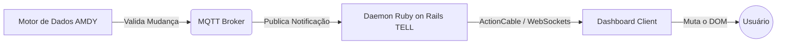

# PROJETO KAD 1.0 (Knowledge Acquisition & Distribution)

> **Paradigma Orientado a Notificações (PON)**  
> *Zero polling. Zero idle CPU. Reatividade absoluta.*

Este relatório compila o estado da arte e a arquitetura do **KAD 1.0**, um framework rudimentar estruturado integralmente sobre o **Paradigma Orientado a Notificações (PON)**, conforme nossas conversas e arquivos de planejamento anteriores armazenados no sistema.

---

## 1. Visão Geral

O **KAD 1.0** age como o sistema nervoso que conecta e orquestra fluxos de trabalho entre dois nós computacionais — **TELL** e **AMDY**. Ele substitui arquiteturas acopladas (como MVC clássico) e rotinas bloqueantes por uma topologia Publish/Subscribe completamente reativa. O objetivo final é alimentar instâncias inteligentes (como o Odysseus AI) com conhecimento extraído automaticamente, sem desperdício de processamento.

## 2. O Paradigma Orientado a Notificações (PON)

No PON, a lógica do sistema não é ditada por fluxos de controle sequenciais ou verificações contínuas (loops). Em vez disso, a computação é dividida estritamente em duas camadas:

### A. Camada Facto-Execucional (Estado e Operações)
- **FBE (Fact-Base Element)**: Entidades independentes que representam um objeto ou conceito do mundo real (ex: um jogo esportivo, um documento). O estado do sistema reside exclusivamente neles.
- **Attribute**: A menor unidade reativa de informação contida em um FBE (ex: o placar de um jogo, o tamanho de um arquivo).
- **Method**: Rotinas executoras (como web scraping ou parsing) que modificam um *Attribute*.

### B. Camada Lógico-Causal (Decisões e Reações)
- **Rule & Condition**: A lógica causal da aplicação. Define-se, por exemplo: `If AttributeChanged Then MqttNotifyAction`. A regra retém a execução se não houver mudança efetiva.
- **Action & Instigation**: A ação disparada pelas regras, que pode instigar um novo método, publicar num barramento ou atualizar o DOM de uma interface gráfica.

## 3. Topologia de Rede e Nós

A arquitetura distribui as responsabilidades entre duas máquinas físicas/virtuais operando em simbiose através do MQTT:

| Nó | Sistema Operacional | Função Principal |
|---|---|---|
| **AMDY** | Arch Linux (Omarchy) | Motor de Dados, Cognição, Broker MQTT central, KAD Bridge (Python), Odysseus AI, ChromaDB e Antigravity CLI. |
| **TELL** | Debian | Armazenamento de dados, Extração Sensorial, Interface Web (Ruby on Rails) e Motor PON escrito em C++17. |

### O Nó AMDY (Motor de Dados)
Atua como o coletor primário e o centro neural. Scripts locais avaliam dados usando as regras PON. Caso um valor seja de fato alterado por um método de scraping, uma *Rule* aciona o *Broker MQTT* notificando sobre a alteração do *FBE*.

### O Nó TELL (Servidor e Dashboard)
O TELL funciona como assinante (Subscriber). Em versões em Ruby on Rails, ele roda daemons/workers (ex: `mqtt_listener.rb`) que escutam os tópicos PON (ex: `kad/amdy/*`). Ao ser notificado:
1. O Listener atua como *Proxy FBE* local.
2. Ele aciona o **ActionCable** (WebSockets).
3. O cliente web injeta a atualização **diretamente no DOM** do usuário.

## 4. O Sistema de Comunicação (Sem Polling)

Não existem bancos de dados intermediários sendo consultados periodicamente (`polling`). O fluxo depende de eventos em tempo real. No TELL (C++ PON Engine), eventos são gerados via `inotify` (eventos de sistema de arquivos) ou `epoll_wait()`.

## 5. Regras de Ouro do KAD 1.0

O framework adota posturas estritas para garantir o cumprimento do paradigma PON:
- ❌ **É Terminantemente Proibido:** Uso de `while(true)`, rotinas bloqueantes (`sleep()`), tarefas baseadas em tempo (`cronjobs`), polling ativo em bancos de dados ou *reloads* completos de páginas na interface.
- ✅ **É Obrigatório:** Uso de interrupções de hardware/kernel, WebSockets (ActionCable), callbacks do Mosquitto (MQTT) e reatividade total nos FBEs.

---
*Relatório gerado com sucesso por Antigravity / Odysseus AI.*
